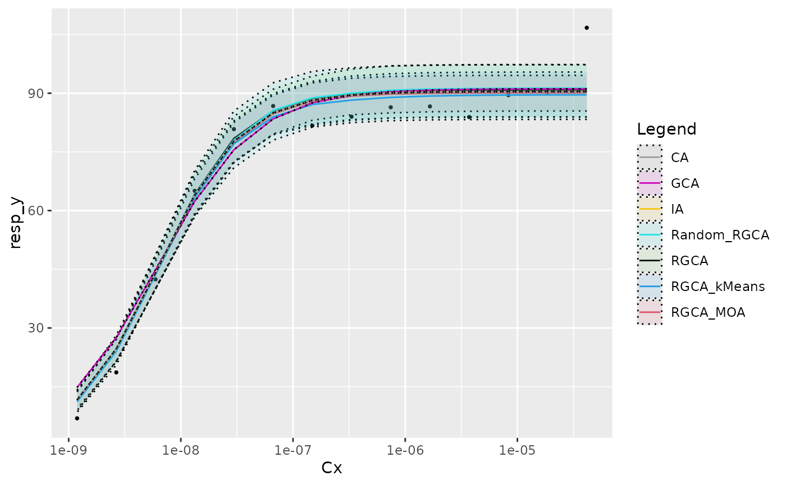
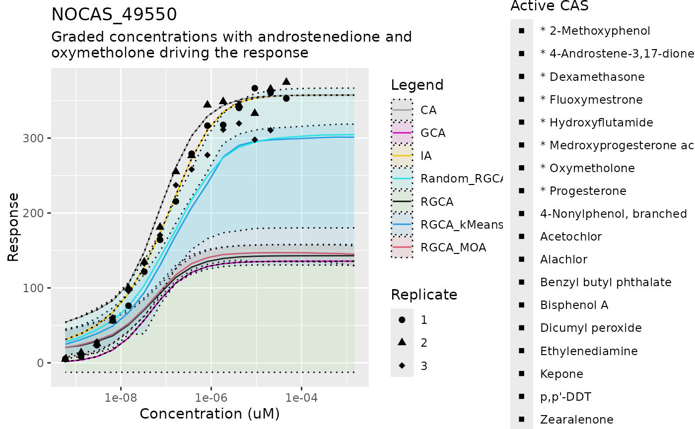
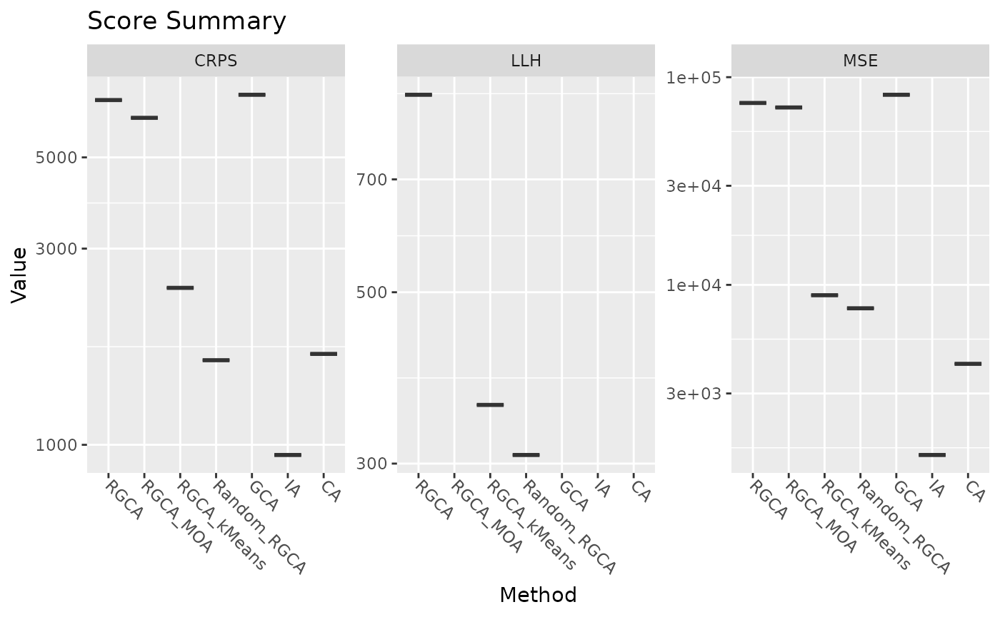

# RGCA Manuscript Pipeline

## The Mixture Prediction Pipeline

This script predicts a response to a mixture of chemicals given an input
data of individual dose responses and the concentrations of the
components of the mixture. The procedure followed in this pipeline is as
follows: 1. Load all inputs 2. Fit individual dose response curves 3.
Cluster the individual dose response slope parameters 4. Create a
collection of predictors (“calculators”) by sampling the slope cluster
and parameters 5. Given a mixture, predict a response with each
calculator. The plots show the 5, 50, and 95 percentile.

### Loading data

To start, we load the required packages, including RGCA, and some
auxiliary files for plotting and reading the Tox21 data. These are not
part of the package because they are specific to the manuscript.

``` r

library(ggplot2)
library(cowplot)
library(reshape2)
library(drc)
#> Loading required package: MASS
#> 
#> 'drc' has been loaded.
#> Please cite R and 'drc' if used for a publication,
#> for references type 'citation()' and 'citation('drc')'.
#> 
#> Attaching package: 'drc'
#> The following objects are masked from 'package:stats':
#> 
#>     gaussian, getInitial
library(readxl)
library(dplyr)
#> 
#> Attaching package: 'dplyr'
#> The following object is masked from 'package:MASS':
#> 
#>     select
#> The following objects are masked from 'package:stats':
#> 
#>     filter, lag
#> The following objects are masked from 'package:base':
#> 
#>     intersect, setdiff, setequal, union
library(scoringRules)
library(RGCA)
library(utils)

source("../inst/manuscript_plots.R")
#> Loading required package: plotly
#> Warning in library(package, lib.loc = lib.loc, character.only = TRUE,
#> logical.return = TRUE, : there is no package called 'plotly'
source("../inst/tox21_prep_data.R")
source("../inst/helper_pipeline.R")
#> Loading required package: coda
#> Warning in library(package, lib.loc = lib.loc, character.only = TRUE,
#> logical.return = TRUE, : there is no package called 'coda'
#> Loading required package: tables
#> Warning in library(package, lib.loc = lib.loc, character.only = TRUE,
#> logical.return = TRUE, : there is no package called 'tables'
```

Next we read the prepared Tox21 data, which creates a series of objects
including the observed dose response $`y_i`$, the concentration for the
observed dose response $`Cx`$, and a list to track which entries are
replicates. Null values are present in the data to indicate an anomalous
response, such as cell death. Some chemicals have 3 replicates and some
have 6.

``` r

input_df <- utils::read.delim("../inst/extdata/AR-luc.txt")
mix_guide <- readxl::read_xls("../inst/extdata/AllMixtureComponentsARER.xls")
read_prepared_Tox21_data(input_df, mix_guide)
message("Observed response")
#> Observed response
head(y_i)
#>            [,1]       [,2]        [,3]       [,4]        [,5]       [,6]
#> [1,]  1.1826353  2.4826635  1.51578025  1.4892761  4.49209447  6.5474142
#> [2,] -0.6334479  0.9216168  0.60169789  2.0617608  1.33278993  0.9216314
#> [3,] -1.5807759  2.9179836  1.48661741 -0.8020371  0.06912863 -0.5359517
#> [4,]  1.3299733  1.1730434 -0.04242502  0.3463708  0.04687224  0.1058324
#> [5,]  0.1689624  1.1800216  0.77479527  0.4291119  0.99653685  0.3122312
#> [6,]  6.9164171 18.6521627 42.43889777 65.0567233 80.80913096 86.7305131
#>            [,7]       [,8]      [,9]      [,10]      [,11]     [,12]     [,13]
#> [1,] 10.0457328 19.4146939 33.582836 47.2007379 57.2383820 94.758215 80.468399
#> [2,]  1.0420852  1.4888338  1.244484  0.5806189 -0.8943978 -1.534201 -1.577272
#> [3,] -0.5994553  0.8354096  1.466298 -0.6603799 -0.5334993 -1.134656 -1.988023
#> [4,]  0.6155381  1.0922728  1.047398  0.3259035 -0.3445795 -1.629641 -4.327155
#> [5,]  3.1553595  0.8027576  3.766346  4.5388174 16.2244239 20.882732 37.762179
#> [6,] 81.7200304 84.0045972 86.404822 86.6209343 83.9145229 89.501855 90.271835
#>           [,14]     [,15]
#> [1,]         NA        NA
#> [2,]  -3.134762 -8.737393
#> [3,]  -1.853277 -4.499909
#> [4,]  -4.470151 -7.752958
#> [5,]         NA        NA
#> [6,] 106.733244        NA
message("Concentration")
#> Concentration
head(Cx)
#>           [,1]      [,2]      [,3]      [,4]      [,5]      [,6]      [,7]
#> [1,] 1.174e-09 2.626e-09 5.871e-09 1.313e-08 2.935e-08 6.564e-08 1.468e-07
#> [2,] 1.125e-09 2.516e-09 5.626e-09 1.258e-08 2.813e-08 6.290e-08 1.407e-07
#> [3,] 1.169e-09 2.613e-09 5.843e-09 1.306e-08 2.921e-08 6.532e-08 1.461e-07
#> [4,] 1.039e-09 2.324e-09 5.197e-09 1.162e-08 2.598e-08 5.810e-08 1.299e-07
#> [5,] 1.200e-09 2.684e-09 6.001e-09 1.342e-08 3.001e-08 6.710e-08 1.500e-07
#> [6,] 1.189e-09 2.659e-09 5.945e-09 1.329e-08 2.972e-08 6.647e-08 1.486e-07
#>           [,8]      [,9]     [,10]     [,11]     [,12]     [,13]     [,14]
#> [1,] 3.282e-07 7.339e-07 1.641e-06 3.669e-06 8.205e-06 1.835e-05        NA
#> [2,] 3.145e-07 7.033e-07 1.573e-06 3.516e-06 7.863e-06 1.758e-05 3.931e-05
#> [3,] 3.266e-07 7.303e-07 1.633e-06 3.652e-06 8.165e-06 1.826e-05 4.083e-05
#> [4,] 2.905e-07 6.496e-07 1.453e-06 3.248e-06 7.263e-06 1.624e-05 3.631e-05
#> [5,] 3.355e-07 7.502e-07 1.677e-06 3.751e-06 8.387e-06 1.875e-05        NA
#> [6,] 3.323e-07 7.431e-07 1.662e-06 3.716e-06 8.308e-06 1.858e-05 4.154e-05
#>          [,15]
#> [1,]        NA
#> [2,] 8.791e-05
#> [3,] 9.129e-05
#> [4,] 8.120e-05
#> [5,]        NA
#> [6,]        NA
message("Replicates by index")
#> Replicates by index
head(replicate_sets)
#> [[1]]
#> [1] 23 44 53
#> 
#> [[2]]
#> [1] 14 18 30 46 50 67
#> 
#> [[3]]
#> [1]  9 36 51
#> 
#> [[4]]
#> [1]  4 41 61
#> 
#> [[5]]
#> [1]  2  7 26 34 60 62
#> 
#> [[6]]
#> [1]  6  8 24 42 49 55
```

### Fitting Dose Responses

A random effect model is fit to each chemical indexed by $`i`$,
``` math
  R_i(c) =f_i(c|a_i,\theta_i,\beta_i, u_{ij}, v_{ij}) =
\frac{a_i+u_{ij}}{1+\left(\frac{\theta_i}{c}\right)^{\beta_i}} + v_{ij} +
\epsilon_{ijc} 
```
The MCMC script uses standard methods.

``` r

re_iter <- 1e4 #for manuscript we use 2.5e4 = 25,000 iterations
set.seed(102)
# fit random effects model
re_chains <- RE_MCMC_fit(y_i, Cx, replicate_sets, n_iter = re_iter)
```

The beginning 5000 iterations of the chains are removed and the
remaining iterations thinned. The thinned samples for relevant
parameters are then provided in a list for sampling downstream, or as
objects with the median parameters for methods that do not need
uncertainty quantification.

``` r

re_par_list <- pull_parameters(re_chains)
# Pull RGCA MCMC parameters estimates without uncertainty
re_par_summary <-
  pull_summary_parameters(re_chains, summry_stat = median)
# Collect the main parameters for clustering
RE_curve_fits <- as.data.frame(list(
  "sill" = re_par_summary$sill_params,
  "ec50" = re_par_summary$ec50_params,
  "slope" = re_par_summary$slope_params
))
```

### Clustering

Clustering is determined either randomly, by sign of the sill, or by a
K-means algorithm. First we generate some random clusters

``` r

# RGCA + random sampling
# create 20 random clusters: 1 GCA, 1 IA, and then 4x2,5x3,5x4,4x5
set.seed(1331)
rand_clust_mat <- c(
  rep(1, 18),
  sample(1:2, 18 * 10, replace = TRUE),
  sample(1:3, 18 * 20, replace = TRUE),
  sample(1:4, 18 * 30, replace = TRUE),
  sample(1:5, 18 * 38, replace = TRUE),
  1:18
) |> matrix(ncol = 18, byrow = TRUE)
rand_clust_assign <- rep(1, nrow(rand_clust_mat))
# This naming approach sets the cluster assignment as a name to each entry, and
# each entry is the weight of that assignment.  Using a vector of 1's implies
# all clusterings are equally weighted.  This allows for the clustering to be
# sampled if more bootstrapped samples are desired.
names(rand_clust_assign) <-
  apply(rand_clust_mat,
        MARGIN = 1,
        FUN = function(rx) {
          do.call(paste, as.list(rx))
        })
randclust_par_list <- list("cluster_assign" = rand_clust_assign)
# save a parameter list with the clustering and MCMC results from before
RGCA_randclust_par_list <- c(re_par_list, randclust_par_list)
```

We follow a similar procedure for the agonist-based (ie sill sign)
clustering.

``` r

one_clust_assign <- 1
clust_by_agonist <- rep(1, n_chems)
clust_by_agonist[AR_agonist_rows] <- 2
names(one_clust_assign) <- do.call(paste, as.list(clust_by_agonist))
RGCA_ARER_clust_par_list <- list(
  "centers" = matrix(re_par_summary$slope_params, nrow = 1),
  "cluster_assign" = one_clust_assign,
  "cent_sd" = matrix(rep(0, n_chems), nrow = 1)
)
RGCA_ARER_par_list <- c(re_par_list, RGCA_ARER_clust_par_list)
```

and then for K-means clustering.

``` r

# RGCA using Kmeans: allow for 1 to 6 clusters
kmeans_clust_mat <- matrix(0, nrow = 6, ncol = n_chems)
# test 1 to 6 cluster centers
for (i in 1:6) {
  kmeans_clust_mat[i, ] <- kmeans(RE_curve_fits, i)$cluster
  # print the ratio of the between-set sum of squares and total to compare
  print(kmeans(RE_curve_fits, i)$betweenss / kmeans(RE_curve_fits, i)$totss)
}
#> [1] -1.452624e-16
#> [1] 0.7180256
#> [1] 0.9227801
#> [1] 0.9460953
#> [1] 0.9490617
#> [1] 0.9509603
kmeans_clust_assign <- rep(1, nrow(kmeans_clust_mat))
names(kmeans_clust_assign) <- apply(kmeans_clust_mat,
                                    MARGIN = 1,
                                    FUN = function(rx) {
                                      do.call(paste, as.list(rx))
                                    })
kmeans_clust_list <- list("cluster_assign" = kmeans_clust_assign)
# save a parameter list with the clustering and MCMC results from before
RGCA_kmeansclust_par_list <- c(re_par_list, kmeans_clust_list)
```

### Special cases

One of the special cases we test is to use the Reflected GCA but without
the clustering. Hence we create one large cluster (like GCA) and keep
the fitted slopes. Regular GCA must set the slope values to 1.

``` r

# RGCA alone ####
one_clust_assign <- 1
names(one_clust_assign) <- do.call(paste, as.list(rep(1, n_chems)))
RGCA_clust_par_list <- list(
  "centers" = matrix(re_par_summary$slope_params, nrow = 1),
  "cluster_assign" = one_clust_assign,
  "cent_sd" = matrix(rep(0, n_chems), nrow = 1)
)
RGCA_par_list <- c(re_par_list, RGCA_clust_par_list)
```

### Creating Calculators

After all the parameter settings are established, we can generate the
calculator functions that take as input the doses for the various
chemicals and output a predicted response. For the methods with
uncertainty quantification, we bootstrap the calculators by using the
function “create_mix_calc,” which will take a sample from the MCMC
posterior.

``` r

set.seed(1026)
# Random cluster calculators
n_bootstraps <- 100
random_clustered_RGCA <-
  sapply(1:n_bootstraps,
         FUN = function(x) {
           create_mix_calc(x,
                           RGCA_randclust_par_list,
                           add_RE = TRUE)
         })
# KMeans clustering calculator
kmeans_samp_idx <- sample(1:6, size = n_bootstraps, replace = TRUE)
sampled_kmeans_clustered_RGCA <-
  sapply(kmeans_samp_idx,
         FUN = function(x) {
           create_mix_calc(x,
                           RGCA_kmeansclust_par_list,
                           add_RE = TRUE)
         })
# No cluster (pure RGCA) calculator
sampled_mix_funs_RGCA <-
  sapply(rep(1, n_bootstraps),
         FUN = function(x) {
           create_mix_calc(x, RGCA_par_list, add_RE = TRUE)
         })
# Sill clustered calculator
sampled_mix_funs_RGCA_ARER <-
  sapply(rep(1, n_bootstraps),
         FUN = function(x) {
           create_mix_calc(x,
                           RGCA_ARER_par_list,
                           add_RE = TRUE)
         })
```

### Standard Methods: IA and GCA

GCA fixes the slope parameters to 1, but we want to allow the other
parameters to adjust to that constraint so we rerun the MCMC algorithm
with the slope fixed to 1.

``` r

set.seed(1025)
# specify the MCMC to fit 2 - parameter Hill models for GCA
re_chains_2param <-
  RE_MCMC_fit(y_i,
              Cx,
              replicate_sets,
              n_iter = re_iter,
              n_hill_par = 2)
re_2par_list <- pull_parameters(re_chains_2param)
# Pull parameter estimates without uncertainty
re_2par_summary <- pull_summary_parameters(re_chains_2param)
```

We now make the parameter lists for the simpler Independent Action (IA)
and regular GCA models. IA uses the parameter estimates from the RGCA
MCMC fit. Neither IA nor GCA nor CA takes advantage of the uncertainty;
this is to demonstrate the utility of the Bayesian method, but in
principle they can all be resampled like RGCA to generate credible
intervals.

First, we finish with GCA and then create the calculator for CA, which
requires the sill parameter to be equal across all chemicals.

``` r

# GCA single calculator: first create the parameter specification
GCA_assign <- 1
names(GCA_assign) <- do.call(paste, as.list(rep(1, n_chems)))
GCA_assign_vec <-
  as.numeric(strsplit(names(GCA_assign), split = " ")[[1]])
param_matrix_GCA <- as.matrix(
  cbind(
    "a" = re_2par_summary$sill_params,
    "b" = re_2par_summary$ec50_params,
    "c" = re_2par_summary$slope_params,
    "max_R" = max(re_par_summary$sill_params),
    "d" = 0
  )
)
# Next use the parameters to instantiate the predictive calculator
GCA_calculator <-
  mix_function_generator(param_matrix_GCA, GCA_assign_vec)

# CA single calculator ####
param_matrix_CA <- as.matrix(
  cbind(
    "a" = re_par_summary$sill_params,
    "b" = re_par_summary$ec50_params,
    "c" = re_par_summary$slope_params,
    "max_R" = 1,
    "d" = 0
  )
)
# simple CA calculator:  force all sill params to be equal
CA_calculator <- mix_function_generator(param_matrix_CA,
                                        GCA_assign_vec,
                                        scale_CA = TRUE)
```

Next we create the calculator for IA.

``` r

#  IA single assignment, all chemicals are separate
IA_assign <- 1
names(IA_assign) <- do.call(paste, as.list(1:n_chems))
IA_assign_vec <-
  as.numeric(strsplit(names(IA_assign), split = " ")[[1]])
param_matrix_IA <- as.matrix(
  cbind(
    "a" = re_par_summary$sill_params,
    "b" = re_par_summary$ec50_params,
    "c" = re_par_summary$slope_params,
    "max_R" = max(re_par_summary$sill_params),
    "d" = 0
  )
)
# build the calculator to predict a response given a dose vector
IA_calculator <-
  mix_function_generator(param_matrix_IA, IA_assign_vec)
```

### Calculator Set

We can collect the calculators into a list, commenting out calculators
as desired to have less cluttered plots. Note

``` r

# select which methods to use for prediction and plotting
bootstrap_calc_list <- list(
  "RGCA" = sampled_mix_funs_RGCA,
  "RGCA_MOA" = sampled_mix_funs_RGCA_ARER,
  "RGCA_kMeans" = sampled_kmeans_clustered_RGCA,
  "Random_RGCA" = random_clustered_RGCA,
  "GCA" = list(GCA_calculator),
  "IA" = list(IA_calculator),
  "CA" = list(CA_calculator)
)
```

\##Predicting Mixture responses

Before proceeding with actual mixtures, we can check that sham mixtures
with only one chemical are correctly modeled.

``` r

plot_dummy_mixture(Cx, y_i, tot_par_list, replicate_sets,
                   bootstrap_calc_list, test_idx = 6)
```



Now we can proceed to predicting with the actual data. The sets of
indices are chosen based on the descriptions of the mixtures. This part
is solving the two-step model with the bootstrapped calculators built on
our fitted parameters and clustering, and can take a few minutes per
mixture

``` r

# all mixtures where the Estrogen Receptor agonists are at 4x their fitted EC50
set_4x <- c(1, 12, 20, 29, 43, 52, 55, 57)
# mixtures from set_4x plus all other mixtures with all chemicals or all
# Androgen receptor agonists present
set_1 <- c(1, 5, 10, 12, 20, 25, 29, 30, 31, 32, 43, 45, 50, 52, 55, 57, 62)
# a single index for testing
mix_idx <- 1# choose one! 16, 8, 27
# a sampling of mixtures with only two components
binary_mixes <- c(8, 34, 37, 61)
# a sampling of chemicals with 3-5 components
small_mixes <- c(6, 26, 47)
# just plot one index for demonstration
score_matrix <- plot_mixture_response(mix_idx, mix_df, mix_conc_df, mix_guide,
                                      bootstrap_calc_list)
#> Scale for shape is already present.
#> Adding another scale for shape, which will replace the existing scale.
```



Finally, we format the score matrix and plot the results of the score
comparisons. Since this demonstration only runs one mixture by default,
the violin plots appear as lines.

``` r

score_df <- data.frame(score_matrix)
# drop rows of 0, in case some mixtures were skipped
score_df <- score_df[apply(score_df,
                           MARGIN = 1,
                           FUN = function(rx) any(rx > 0)), ]
names(score_df) <- c("Mix id", paste(names(bootstrap_calc_list), c("LLH")),
                     paste(names(bootstrap_calc_list), c("MSE")),
                     paste(names(bootstrap_calc_list), c("CRPS")))

## Violin Plot for Scores ####
plot_scores(score_df[1, ], bootstrap_calc_list)
#> No id variables; using all as measure variables
#> No id variables; using all as measure variables
#> No id variables; using all as measure variables
```


