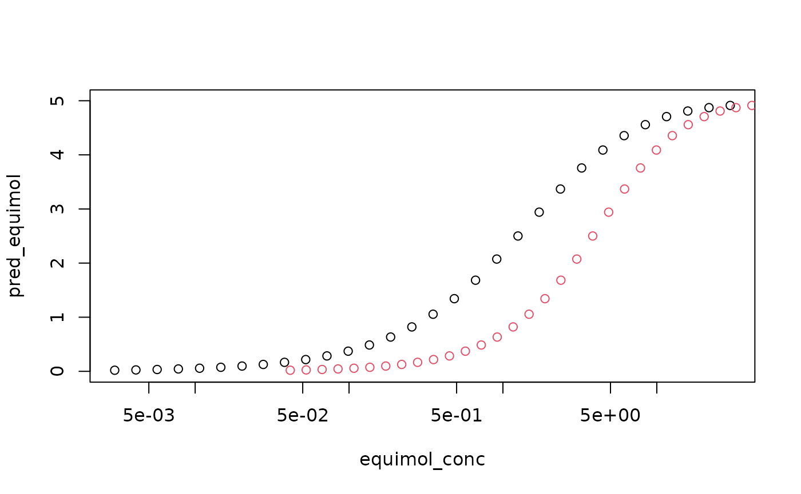
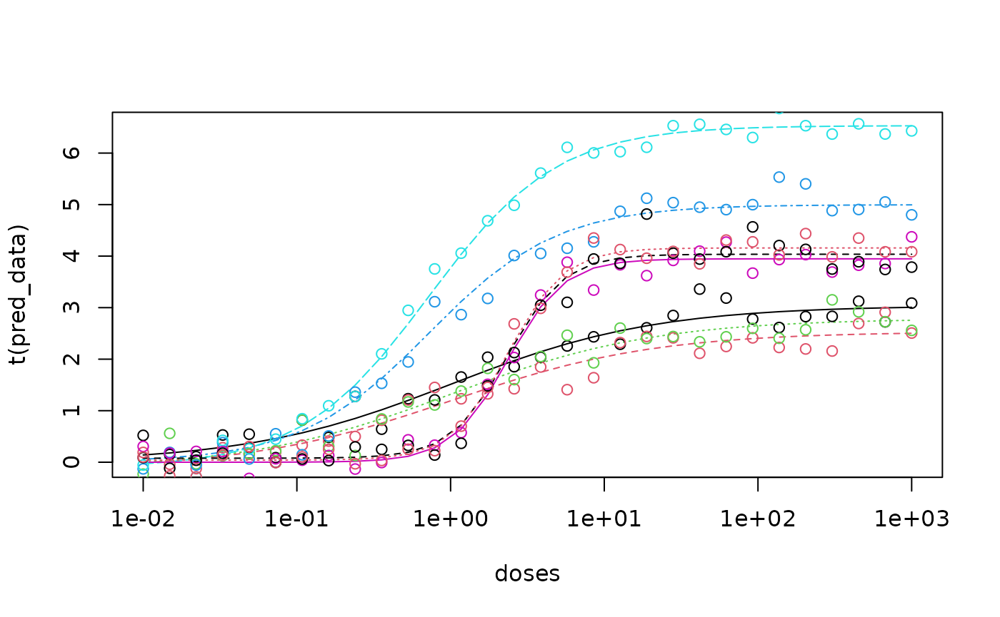

# Simple Application of RGCA

## Simple Usage of RGCA

While the method could be generalize to a variety of smooth, monotone
dose response functions, our package is designed around the Hill
function,
``` math
f(x|a,b,c) = \frac{a}{1+\left(\frac{b}{x}\right)^{c}}
```
The parameters are the sill (a), the EC50 (b), and the slope (c). Give
these parameters and a cluster assignment vector, RGCA can create a
calculator that predicts the mixture response given an input dose vector
$`(x_1,...,x_n)`$. In the example below, there are three chemicals with
known Hill parameters.

``` r

n_chems <- 3
sills <- c(3, 5, 4)
ec50_vec <- c(1, 0.75, 2.4)
slopes <- c(0.75, 1.1, 2.0)
# Rmax is used to scale IA across clusters, can copy sills
param_matrix <- as.matrix(cbind("a" = sills,
                                "b" = ec50_vec,
                                "c" = slopes,
                                "max_R" = sills))
```

The cluster assignment vector is used to group the chemicals by
similarity. If two chemicals are in the same group, they are assumed to
be equivalent after adjusting for potency. If all chemicals are added to
one group via, the prediction is equivalent to concentration additon
(AKA dose addition, Loewe Additivity). If all chemicals are added to
separate groups, the prediction is equivalent to independent action (AKA
response addition, Bliss independence).

``` r

# Example 1: concentration addition
cluster_assign_vec <- c(1, 1, 1)
# Example 2: independent action
cluster_assign_vec <- c(1, 2, 3)
# A random cluster
cluster_assign_vec <- c(1, 2, 1)
# create a calculator to predict response given concentration
mix_pred <- mix_function_generator(param_matrix, cluster_assign_vec)
```

To create a mixture, we need to specify the concentration of each
chemical.

``` r

# generate mix concentrations:  each row of the matrix is one dose of the mix
n_samps <- 30
# equipotent mixture: concentrations scaled by EC50
equipot_conc_matrix <- matrix(0, nrow = n_samps, ncol = n_chems)
# equimolar mixture: equal concentration of all chemicals
equimol_conc_matrix <- matrix(0, nrow = n_samps, ncol = n_chems)
# generate concentrations on the log scale
for (chem_idx in 1:n_chems) {
  equipot_conc_matrix[, chem_idx] <-
    ec50_vec[chem_idx] / (10^seq(2, -1, length.out = n_samps))
  equimol_conc_matrix[, chem_idx] <-
    1 / (10^seq(3, -1, length.out = n_samps))
}
#create the mixture concentration vector for plotting
equipot_conc <- rowSums(equipot_conc_matrix)
equimol_conc <- rowSums(equimol_conc_matrix)
# Apply the pediction function to the concentrations of interest
pred_equipot <- apply(equipot_conc_matrix,
                      MARGIN = 1,
                      FUN = function(x) mix_pred(x))
pred_equimol <- apply(equimol_conc_matrix,
                      MARGIN = 1,
                      FUN = function(x) mix_pred(x))
```

Now we can plot the two predicted mixture responses.

``` r

plot(equimol_conc, pred_equimol, log = "x", ylim = c(0, 5))
points(equipot_conc, pred_equimol, col = 2)
```

 \##
Fitting Dose Response Curves In the example above, we assume the
parameters are known. If you have raw data for the individual chemical
dose responses and want to fit the random effect model that we describe
in our manuscript, the RGCA package has a built-in Bayesian MCMC fitting
routing. Our function is designed to fit the Hill model described
earlier with random effects (u, v) for the replicates:
``` math
f(x |a,b,c) = \frac{a + u}{1+\left(\frac{b}{x}\right)^{c}}+ v + \epsilon
```
The random effects allow for the replicates to have different responses
by either adjusting the maximum effect (u) or by adjusting the minimum
effect (v). Three pieces of data are needed: the responses, the doses,
and a list of the replicates. We will sample curves using the specified
parameters.

``` r

set.seed(123)
replicate_sets <- list(c(1, 2, 3), c(4, 5), c(6, 7, 8))
n_repls <- max(unlist(replicate_sets))
doses <- 1 / (10^seq(2, -3, length.out = n_samps))
Cx <- matrix(doses, nrow = n_repls, ncol = n_samps, byrow = TRUE)
# specify which rows of the data will correspond to which parameter
data <- matrix(0, nrow = n_repls, ncol = n_samps)
#iterate over the parameter sets
for (rep_idx in seq_along(replicate_sets)){
  # iterate over replicates
  for (row_idx in replicate_sets[[rep_idx]]){
    hill_params <- param_matrix[rep_idx, 1:3]
    # add random effect for sill
    samp_sd_u <- ifelse(row_idx == replicate_sets[[rep_idx]][1], 0, 1)
    hill_params[["a"]] <- hill_params[["a"]] + rnorm(1, sd = samp_sd_u)
    data[row_idx, ] <- sapply(doses, FUN = function(d) {
      do.call(hill_function, as.list(c(hill_params, conc = d)))
    })
  }
}
# now we add iid noise to simulate observations
noisy_data <- data + matrix(rnorm(length(data), sd = 0.25), nrow = 8)
```

The output is plotted and looks reasonable.

``` r

matplot(doses, t(data), type = "l", log = "x")
matplot(doses, t(noisy_data), type = "p", add = TRUE, pch = 1)
```

 Now we can
run our custom MCMC script to fit the data.

``` r

RE_mcmc_chains <- RE_MCMC_fit(y_i = noisy_data,
            Cx = Cx,
           replicate_sets = replicate_sets)
```

We use a helper function to extract the relevant parameters and compare
to the true parameters.

``` r

RE_params = pull_summary_parameters(RE_mcmc_chains, summry_stat = median)

print(RE_params)
```

    ## $sill_params
    ## [1] 3.039055 4.997729 3.947410
    ## 
    ## $sill_sd
    ## [1] 0.07896465 0.06644112 0.06192497
    ## 
    ## $ec50_params
    ## [1] 1.0168967 0.7195774 2.3454213
    ## 
    ## $ec50_stdev
    ## [1] 0.16024360 0.04082689 0.09366453
    ## 
    ## $u_RE_params
    ## [1]  0.00000000 -0.37343283 -0.11834004  0.00000000  1.64234934  0.00000000
    ## [7]  0.01136244  0.17092552
    ## 
    ## $v_RE_params
    ## [1]  0.00000000 -0.13420422 -0.13471061  0.00000000 -0.10752350  0.00000000
    ## [7]  0.07774817  0.04011637
    ## 
    ## $u_RE_sd_params
    ## [1] 0.5009757 2.1398733 0.3794902
    ## 
    ## $v_RE_sd_params
    ## [1] 0.3948315 0.5540349 0.3663125
    ## 
    ## $slope_params
    ## [1] 0.6551344 1.0399488 2.3618687

Note that in addition to extracting the point estimates of the
parameters (using the median by default), the standard deviations are
also extracted. They are not used here, but can provide uncertainty
quantification by sampling values and plotting the resulting curves.

``` r

fitted_params = as.matrix(cbind("a" = RE_params$sill_params,
                                "b" = RE_params$ec50_params,
                                "c" = RE_params$slope_params))
u_pars = RE_params$u_RE_params
v_pars = RE_params$v_RE_params
pred_data = data*0
for(rep_idx in seq_along(replicate_sets)){
  # iterate over replicates
  for(row_idx in replicate_sets[[rep_idx]]){
    hill_params <- fitted_params[rep_idx,]
    # add random effect for sill
    hill_params[['a']] <- hill_params[['a']] + u_pars[row_idx]
    pred_data[row_idx,] <- sapply(Cx[rep_idx,], FUN = function(d) {
      do.call(hill_function, as.list(c(hill_params, conc = d)))
    }) + v_pars[row_idx]
  }
}
matplot(doses,t(pred_data), type = "l", log = "x"); matplot(doses, t(noisy_data), type = "p",add = T, pch = 1)
```


